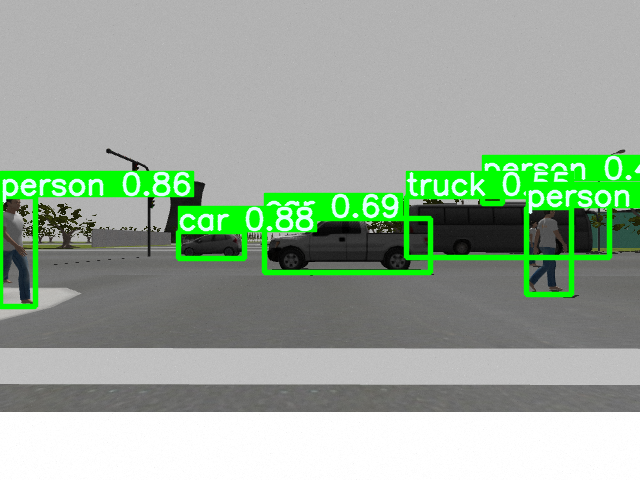
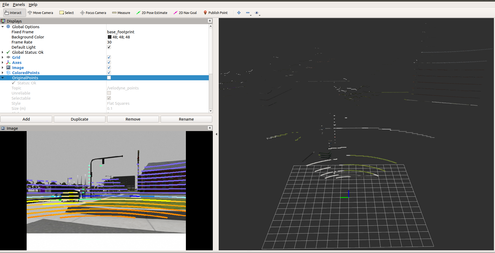
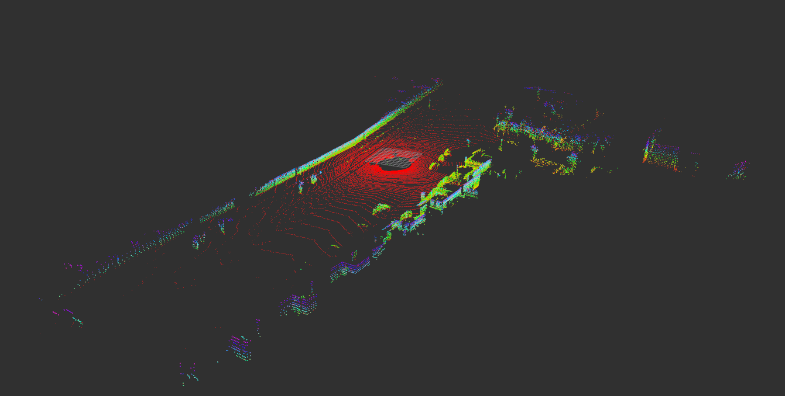
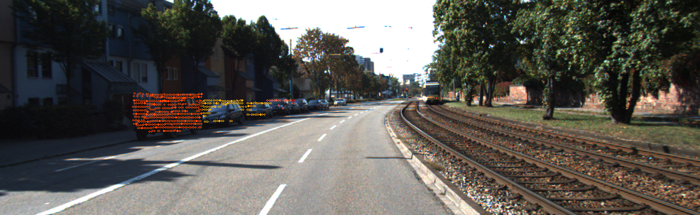
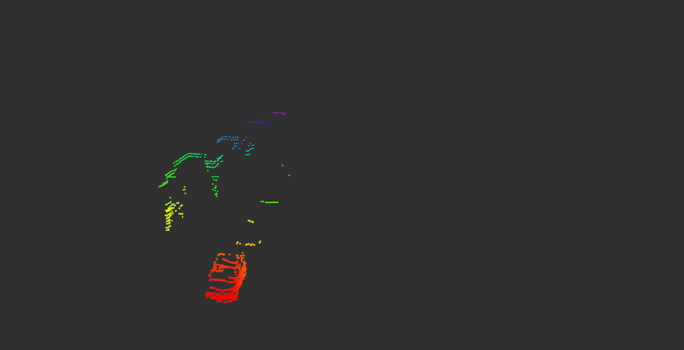
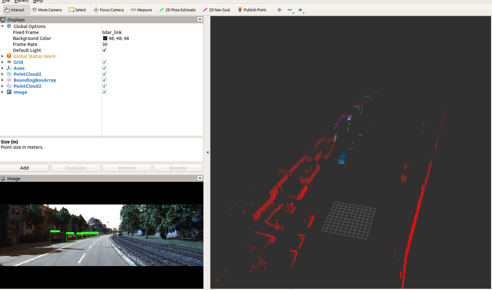

# 3d-object-detection
this is a reproduction of my senior's graduation project

---
## TODO:
- [x] camera intrinsic calibration
- [ ] camera lidar calibration
- [x] yolo object detection
- [x] cloud identification
- [x] cloud clustering 

## Environments:
- PyTorch 1.10
- Cuda 11.3
- device NVIDIA RTX 3050ti
## YOLOv5 detection
change the topic in ```yolo_ros/config/config.yaml``` or you can run by default using laptop camera
``` 
roslaunch usb_cam usb_cam-test.launch 
roslaunch yolo_ros demo.launch
```

## lidar camera fusion
change the lidar and camera topic in ```colored_pointcloud/config/calib_results.yaml```. This package will project the cloud to image and color the cloud.
```
roslaunch colored_pointcloud colored_poincloud_node.launch
```

## Iterative lidar ground filter

```
roslaunch cam_lidar_fusion ground_filter.launch 
```
## Project the lidar cloud to yolo img
Since we have detected the car or person using yolo, and then we project the corresponding lidar points of each object. Different object are colored invidually. 


## Get the object cloud in rviz
We do this supposing we have already known the cameram intrinsis and extrinsic and you can change it in the ```cam_lidar_fusion/config/cloud_cluster.yaml ```
 
## Final results
I just take one frame of kitti dataset for example



Many thanks to my friend Ouyang and my senior Caoming for their code.
